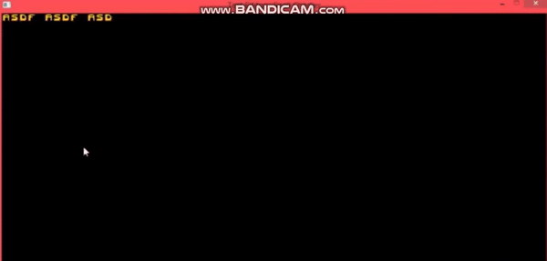
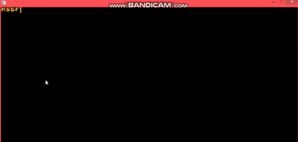

# Text Editor

### A simple Text Editor programmed using pure C and SDL2 library.

## SDL2
Simple DirectMedia Layer(SDL) is a cross-platform software development library designed to provide a hardware abstraction layer for computer multimedia hardware components.
The library is internally written in C and possibly, depending on the target platform, C++ or Objective-C, and provides the application programming interface in C, with bindings to other languages available. It is free and open-source software.

## Features
- Single translation unit build
- Collapsing two lines into one (when it is possible)
- A blinking cursor
- Horizontal Scrolling
- Back spacing
- Mono spaced Bitmap font for displaying Text
- Word wrapping
- No word wrapping when there are no spaces

  If the length of the word typed is greater than the screen width, that is, if there are no spaces then the wrapping of word will not take place.
## Preview

## Tech Stack 
- C Language
- SDL2 
- SDL2 image
## Setting up SDL
Refer the link to set up SDL library on your system.

https://www.cprogramming.com/tutorial/sdl/setup.html
## Tips(Optional)
Use **Visual studio 2019** for programming.
